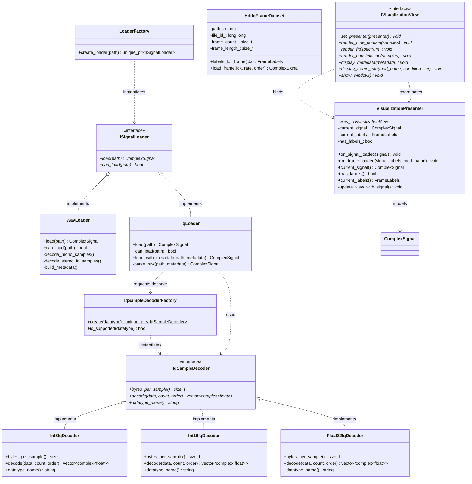

# Module 1: Signal Ingestion and Dataset Adapter Documentation

## 1. Overview and Purpose

### 1.1 What is Module 1?
Module 1 is the signal ingestion, decoding, metadata validation, and dataset adapter foundation for the **WAVIQ** digital signal processing and machine learning analysis platform. Its primary responsibility is taking arbitrary radio frequency (RF) captures and benchmark datasets stored in disparate audio, binary, and container formats on disk, validating them against strict integrity rules, and normalizing them into a unified, in-memory representation: [`ComplexSignal`](file:///home/namanoncode/Documents/GitHub/WAVIQ/module1/include/module1/SignalTypes.h#L55).

### 1.2 Responsibilities
1. **Multi-Format Ingestion**:
   - **Audio Containers**: Load mono (real-valued) and stereo (2-channel I/Q) WAV files using standard bit depths (PCM16, PCM24, Float32).
   - **Raw Binary I/Q**: Ingest headerless raw streams with interleaved in-phase ($I$) and quadrature ($Q$) samples in signed 8-bit integer (`int8`), signed 16-bit integer (`int16`), or 32-bit floating point (`float32`), in little-endian or big-endian byte order.
   - **Sidecar Metadata**: Discover and parse SigMF-compliant `.sigmf-meta` JSON sidecar files to extract sample rate and datatype specifications.
   - **Containerized ML Datasets**: Ingest IEEE-754 binary16 (half-precision float) frame datasets stored in HDF5 (`.h5`), specifically tailored to the schema of the Mendeley "Deep Learning-Based Radio Signal Classification" dataset (`dataset3_iq_frames.h5`).
2. **Strict Metadata Enforcement ("Never Guess")**:
   - For audio containers (WAV), extract sampling rate and channel configuration directly from validated headers.
   - For raw binary I/Q without sidecars or with incomplete sidecars, refuse to fabricate or assume defaults (e.g., never default to 1 MSps or little-endian). Raise explicit, actionable exceptions ([`MissingMetadataError`](file:///home/namanoncode/Documents/GitHub/WAVIQ/module1/include/module1/LoaderExceptions.h#L50)) enumerating exactly what fields are missing.
   - For datasets missing sample rate metadata (such as the Mendeley HDF5 files), require caller-supplied sampling frequencies.
3. **Normalization and Conversion**:
   - Normalize all sample data to single-precision complex numbers ([`std::complex<float>`](file:///home/namanoncode/Documents/GitHub/WAVIQ/module1/include/module1/SignalTypes.h#L58)), where real represents $I$ and imaginary represents $Q$.
   - Scale integer formats accurately: `int8` divided by $128.0\text{f}$, `int16` divided by $32768.0\text{f}$, leaving floats untouched.
   - Software-decode IEEE-754 binary16 half-precision floats to IEEE-754 binary32 single-precision floats portably without requiring compiler- or OS-dependent native half-float support.
4. **Safe Resource Management (RAII)**:
   - Encapsulate all native C resource handles (such as `SNDFILE*` from `libsndfile` and `hid_t` from `libhdf5`) within RAII wrappers ensuring deterministic closure and zero leaks under standard control flow or C++ exception unwinding.

---

## 2. System Position and Pipeline Context

In the broader WAVIQ architecture, the signal processing workflow follows a unidirectional multi-module pipeline:

```
+------------------------------------------------------------------------------------------------+
|                                           WAVIQ PIPELINE                                       |
+------------------------------------------------------------------------------------------------+

     [ Input Storage ]
     - file.wav
     - file.iq (+ .sigmf-meta)
     - dataset.h5
            |
            v
 +----------------------+
 |       MODULE 1       |  <--- Signal Ingestion & Decoding (Current Codebase)
 |  (Ingestion/Adapter) |       - Header parsing, schema validation
 +----------------------+       - Raw decoding, float16 -> float32 conversion
            |                   - Normalization into canonical in-memory representation
            |
            v Hand-off: module1::ComplexSignal
 +----------------------+
 |       MODULE 2       |  <--- Signal Preprocessing & Transformation (Planned)
 |   (Preprocessing)    |       - Filtering, windowing, framing, DDC
 +----------------------+       - Spectral transforms (FFT, STFT, PSD)
            |
            v Hand-off: Spectral / Filtered Data
 +----------------------+
 |       MODULE 3       |  <--- Signal Classification / Analysis (Planned)
 | (Inference / Demod)  |       - Modulation classification, feature extraction
 +----------------------+       - Demodulation, metric evaluation
            |
            v Hand-off: Metrics, Spectrograms, Constellation Points
 +----------------------+
 |       MODULE 1       |  <--- Signal Visualization & Export (Planned Architecture Role)
 | (Output / View Layer)|       - Time-domain waveform, FFT spectrum, constellation plots
 +----------------------+       - Export to SigMF / WAV / CSV
```

### Module 1 to Module 2 Hand-off Contract
Module 1 produces an immutable instance of [`ComplexSignal`](file:///home/namanoncode/Documents/GitHub/WAVIQ/module1/include/module1/SignalTypes.h#L55). Module 2 consumes this object exclusively via its public interface:
- `sig.samples()`: Provides direct contiguous memory access (`const std::vector<std::complex<float>>&`) to normalized $I/Q$ sample pairs.
- `sig.sample_rate()`: Sample rate in Hertz ($Hz$), guaranteed to be positive and non-zero.
- `sig.sample_count()`: Total number of complex samples.
- `sig.metadata()`: Immutable inspection of the capture format, bit depth, channel configuration, source file path, and provenance.

Module 2 and downstream analysis modules are completely decoupled from file formats: they do not know or care whether samples originated from a 16-bit PCM WAV, a big-endian raw IQ capture, or a float16 HDF5 frame.

---

## 3. Directory and File Inventory

Every source file and header in Module 1 has a singular, dedicated purpose:

| File Path | Component Type | Primary Purpose & Responsibility |
|:---|:---|:---|
| [`include/module1/SignalTypes.h`](file:///home/namanoncode/Documents/GitHub/WAVIQ/module1/include/module1/SignalTypes.h) | Public Header | Defines core types: [`ComplexSignal`](file:///home/namanoncode/Documents/GitHub/WAVIQ/module1/include/module1/SignalTypes.h#L55), [`SignalMetadata`](file:///home/namanoncode/Documents/GitHub/WAVIQ/module1/include/module1/SignalTypes.h#L24), [`IqArrangement`](file:///home/namanoncode/Documents/GitHub/WAVIQ/module1/include/module1/SignalTypes.h#L12), and [`ByteOrder`](file:///home/namanoncode/Documents/GitHub/WAVIQ/module1/include/module1/SignalTypes.h#L16). |
| [`include/module1/LoaderExceptions.h`](file:///home/namanoncode/Documents/GitHub/WAVIQ/module1/include/module1/LoaderExceptions.h) | Public Header | Defines the domain exception hierarchy rooted at [`SignalLoaderError`](file:///home/namanoncode/Documents/GitHub/WAVIQ/module1/include/module1/LoaderExceptions.h#L11). |
| [`include/module1/ISignalLoader.h`](file:///home/namanoncode/Documents/GitHub/WAVIQ/module1/include/module1/ISignalLoader.h) | Public Header | Pure virtual interface [`ISignalLoader`](file:///home/namanoncode/Documents/GitHub/WAVIQ/module1/include/module1/ISignalLoader.h#L9) defining the file loader contract. |
| [`include/module1/WavLoader.h`](file:///home/namanoncode/Documents/GitHub/WAVIQ/module1/include/module1/WavLoader.h) | Public Header | Declaration of [`WavLoader`](file:///home/namanoncode/Documents/GitHub/WAVIQ/module1/include/module1/WavLoader.h#L13), implementing [`ISignalLoader`](file:///home/namanoncode/Documents/GitHub/WAVIQ/module1/include/module1/ISignalLoader.h#L9) for audio containers. |
| [`src/WavLoader.cpp`](file:///home/namanoncode/Documents/GitHub/WAVIQ/module1/src/WavLoader.cpp) | Implementation | Uses `libsndfile` to decode PCM16, PCM24, and Float32 mono/stereo WAV files with RAII handle cleanup. |
| [`include/module1/IqMetadata.h`](file:///home/namanoncode/Documents/GitHub/WAVIQ/module1/include/module1/IqMetadata.h) | Public Header | Declares [`IqMetadataInput`](file:///home/namanoncode/Documents/GitHub/WAVIQ/module1/include/module1/IqMetadata.h#L12) struct and the [`SigmfMetadataParser`](file:///home/namanoncode/Documents/GitHub/WAVIQ/module1/include/module1/IqMetadata.h#L42) utility class. |
| [`src/IqMetadataParser.cpp`](file:///home/namanoncode/Documents/GitHub/WAVIQ/module1/src/IqMetadataParser.cpp) | Implementation | Discovers `<file>.sigmf-meta` sidecars and parses SigMF global objects using `nlohmann::json`. |
| [`include/module1/IqSampleDecoder.h`](file:///home/namanoncode/Documents/GitHub/WAVIQ/module1/include/module1/IqSampleDecoder.h) | Public Header | Declares strategy interface [`IIqSampleDecoder`](file:///home/namanoncode/Documents/GitHub/WAVIQ/module1/include/module1/IqSampleDecoder.h#L16), concrete decoders ([`Int8IqDecoder`](file:///home/namanoncode/Documents/GitHub/WAVIQ/module1/include/module1/IqSampleDecoder.h#L34), [`Int16IqDecoder`](file:///home/namanoncode/Documents/GitHub/WAVIQ/module1/include/module1/IqSampleDecoder.h#L44), [`Float32IqDecoder`](file:///home/namanoncode/Documents/GitHub/WAVIQ/module1/include/module1/IqSampleDecoder.h#L54)), and [`IqSampleDecoderFactory`](file:///home/namanoncode/Documents/GitHub/WAVIQ/module1/include/module1/IqSampleDecoder.h#L64). |
| [`src/IqSampleDecoder.cpp`](file:///home/namanoncode/Documents/GitHub/WAVIQ/module1/src/IqSampleDecoder.cpp) | Implementation | Implements byte-swapping, sample decoding, buffer validation, and normalization for raw formats. |
| [`include/module1/IqLoader.h`](file:///home/namanoncode/Documents/GitHub/WAVIQ/module1/include/module1/IqLoader.h) | Public Header | Declaration of [`IqLoader`](file:///home/namanoncode/Documents/GitHub/WAVIQ/module1/include/module1/IqLoader.h#L18), implementing [`ISignalLoader`](file:///home/namanoncode/Documents/GitHub/WAVIQ/module1/include/module1/ISignalLoader.h#L9) for raw `.iq` files. |
| [`src/IqLoader.cpp`](file:///home/namanoncode/Documents/GitHub/WAVIQ/module1/src/IqLoader.cpp) | Implementation | Coordinates sidecar discovery, manual metadata validation, stream sizing, and decoder invocation. |
| [`include/module1/LoaderFactory.h`](file:///home/namanoncode/Documents/GitHub/WAVIQ/module1/include/module1/LoaderFactory.h) | Public Header | Factory interface [`LoaderFactory`](file:///home/namanoncode/Documents/GitHub/WAVIQ/module1/include/module1/LoaderFactory.h#L12) and helper [`make_loader_for`](file:///home/namanoncode/Documents/GitHub/WAVIQ/module1/include/module1/LoaderFactory.h#L20) for route-by-extension loading. |
| [`src/LoaderFactory.cpp`](file:///home/namanoncode/Documents/GitHub/WAVIQ/module1/src/LoaderFactory.cpp) | Implementation | Routes `.wav` to [`WavLoader`](file:///home/namanoncode/Documents/GitHub/WAVIQ/module1/include/module1/WavLoader.h#L13) and `.iq` to [`IqLoader`](file:///home/namanoncode/Documents/GitHub/WAVIQ/module1/include/module1/IqLoader.h#L18); rejects unknown extensions. |
| [`include/module1/Float16.h`](file:///home/namanoncode/Documents/GitHub/WAVIQ/module1/include/module1/Float16.h) | Public Header | Header-only portable IEEE-754 binary16 (half-precision) to IEEE-754 binary32 float decoder [`half_to_float`](file:///home/namanoncode/Documents/GitHub/WAVIQ/module1/include/module1/Float16.h#L17). |
| [`include/module1/HdfFrameLabels.h`](file:///home/namanoncode/Documents/GitHub/WAVIQ/module1/include/module1/HdfFrameLabels.h) | Public Header | Declares [`FrameLabels`](file:///home/namanoncode/Documents/GitHub/WAVIQ/module1/include/module1/HdfFrameLabels.h#L16) ML annotation struct and [`ModulationLabelMap`](file:///home/namanoncode/Documents/GitHub/WAVIQ/module1/include/module1/HdfFrameLabels.h#L22). |
| [`include/module1/HdfIqFrameDataset.h`](file:///home/namanoncode/Documents/GitHub/WAVIQ/module1/include/module1/HdfIqFrameDataset.h) | Public Header | Adapter class [`HdfIqFrameDataset`](file:///home/namanoncode/Documents/GitHub/WAVIQ/module1/include/module1/HdfIqFrameDataset.h#L43) and axis convention enum [`IqAxisOrder`](file:///home/namanoncode/Documents/GitHub/WAVIQ/module1/include/module1/HdfIqFrameDataset.h#L21). |
| [`src/HdfIqFrameDataset.cpp`](file:///home/namanoncode/Documents/GitHub/WAVIQ/module1/src/HdfIqFrameDataset.cpp) | Implementation | Implements HDF5 dataset parsing, schema verification, hyperslab selection, RAII handle management, and frame extraction. |
| [`src/main.cpp`](file:///home/namanoncode/Documents/GitHub/WAVIQ/module1/src/main.cpp) | Application | Command-line interface executable (`module1_cli`) demonstrating file loading and metadata inspection. |
| [`CMakeLists.txt`](file:///home/namanoncode/Documents/GitHub/WAVIQ/module1/CMakeLists.txt) | Build Definition | CMake build configuration for `module1_core` library and `module1_cli` executable. |
| [`tests/CMakeLists.txt`](file:///home/namanoncode/Documents/GitHub/WAVIQ/module1/tests/CMakeLists.txt) | Build Definition | Test harness target definition for `module1_tests`. |
| [`include/module1/VisualizationView.h`](file:///home/namanoncode/Documents/GitHub/WAVIQ/module1/include/module1/VisualizationView.h) | Public Header | Declares [`IVisualizationView`](file:///home/namanoncode/Documents/GitHub/WAVIQ/module1/include/module1/VisualizationView.h) pure virtual interface for the passive MVP desktop GUI layer. |
| [`include/module1/VisualizationPresenter.h`](file:///home/namanoncode/Documents/GitHub/WAVIQ/module1/include/module1/VisualizationPresenter.h) | Public Header | Declares and implements [`VisualizationPresenter`](file:///home/namanoncode/Documents/GitHub/WAVIQ/module1/include/module1/VisualizationPresenter.h), coordinating between ingestion Model/DSP and the passive View. |
| [`tests/test_module1.cpp`](file:///home/namanoncode/Documents/GitHub/WAVIQ/module1/tests/test_module1.cpp) | Test Suite | 33 automated test functions covering 384 independent verification checks across all loaders, decoders, MVP presenter/view coordination, and edge cases. |

---

## 4. Class Architecture, Inheritance, and Design Patterns

### 4.1 Class Hierarchy and Object-Oriented Architecture



### 4.2 Design Patterns Applied and Why
1. **Strategy Pattern ([`IIqSampleDecoder`](file:///home/namanoncode/Documents/GitHub/WAVIQ/module1/include/module1/IqSampleDecoder.h#L16))**:
   - *Why*: Raw binary streams differ only in their binary representation of samples (`int8`, `int16`, `float32`, endianness). Isolating sample conversion from file I/O allows new binary encodings (e.g. `uint8`, `int24`, `float64`) to be added with zero changes to [`IqLoader`](file:///home/namanoncode/Documents/GitHub/WAVIQ/module1/include/module1/IqLoader.h#L18).
2. **Factory Pattern ([`LoaderFactory`](file:///home/namanoncode/Documents/GitHub/WAVIQ/module1/include/module1/LoaderFactory.h#L12) & [`IqSampleDecoderFactory`](file:///home/namanoncode/Documents/GitHub/WAVIQ/module1/include/module1/IqSampleDecoder.h#L64))**:
   - *Why*: Decouples high-level callers from concrete subclasses. The caller passes a file path to [`LoaderFactory::create_loader`](file:///home/namanoncode/Documents/GitHub/WAVIQ/module1/include/module1/LoaderFactory.h#L16) or a type name to [`IqSampleDecoderFactory::create`](file:///home/namanoncode/Documents/GitHub/WAVIQ/module1/include/module1/IqSampleDecoder.h#L68) and receives an interface pointer.
3. **Adapter Pattern ([`HdfIqFrameDataset`](file:///home/namanoncode/Documents/GitHub/WAVIQ/module1/include/module1/HdfIqFrameDataset.h#L43))**:
   - *Why*: Mendeley HDF5 datasets contain thousands of distinct, labeled 1024-sample frames, rather than one continuous recording. Forcing HDF5 into [`ISignalLoader::load(path)`](file:///home/namanoncode/Documents/GitHub/WAVIQ/module1/include/module1/ISignalLoader.h#L16) would require loading millions of samples into a single monolithic buffer, losing frame boundaries and label metadata. Instead, [`HdfIqFrameDataset`](file:///home/namanoncode/Documents/GitHub/WAVIQ/module1/include/module1/HdfIqFrameDataset.h#L43) adapts the multi-dataset HDF5 container into on-demand frame loads yielding standard [`ComplexSignal`](file:///home/namanoncode/Documents/GitHub/WAVIQ/module1/include/module1/SignalTypes.h#L55) objects.
4. **Model-View-Presenter (MVP) Pattern ([`VisualizationPresenter`](file:///home/namanoncode/Documents/GitHub/WAVIQ/module1/include/module1/VisualizationPresenter.h), [`IVisualizationView`](file:///home/namanoncode/Documents/GitHub/WAVIQ/module1/include/module1/VisualizationView.h))**:
   - *Why*: Separates signal processing / data models from GUI presentation for the standalone desktop application without adding network, REST, or API controllers. The View ([`IVisualizationView`](file:///home/namanoncode/Documents/GitHub/WAVIQ/module1/include/module1/VisualizationView.h)) is completely passive and performs zero DSP; the Presenter ([`VisualizationPresenter`](file:///home/namanoncode/Documents/GitHub/WAVIQ/module1/include/module1/VisualizationPresenter.h)) acts as the sole coordinator between ingested [`ComplexSignal`](file:///home/namanoncode/Documents/GitHub/WAVIQ/module1/include/module1/SignalTypes.h#L55) / dataset frames and presentation callbacks (time-domain, FFT magnitude spectrum, constellation diagram, waterfall spectrogram, metadata, frame info). This enables automated headless unit testing via stub views ([`StubVisualizationView`](file:///home/namanoncode/Documents/GitHub/WAVIQ/module1/tests/test_module1.cpp#L1078)) without a display server.
5. **RAII (Resource Acquisition Is Initialization)**:
   - *Why*: Prevents descriptor leaks in external C libraries (`libsndfile`, `libhdf5`). See Section 5.

---

## 5. Memory Management and RAII

Module 1 enforces explicit ownership semantics with zero manual memory management (`new`/`delete` or naked `malloc`/`free` do not appear in application logic).

### 5.1 RAII Wrappers for C Handles
Native C libraries return opaque handles that must be closed even when exceptions are thrown:

1. **`SndfileHandle` ([`src/WavLoader.cpp`](file:///home/namanoncode/Documents/GitHub/WAVIQ/module1/src/WavLoader.cpp#L16-L50))**:
   - Manages a pointer to `SNDFILE`.
   - The destructor calls `sf_close(file_)`.
   - Copy construction and copy assignment are disabled (`delete`). Move construction and move assignment transfer ownership safely.
2. **`HdfHandle` ([`src/HdfIqFrameDataset.cpp`](file:///home/namanoncode/Documents/GitHub/WAVIQ/module1/src/HdfIqFrameDataset.cpp#L19-L61))**:
   - Manages an HDF5 identifier `hid_t` and stores a function pointer closer (`H5Dclose`, `H5Sclose`, `H5Tclose`, `H5Aclose`).
   - The destructor automatically invokes the closer if `id_ >= 0`.
   - Completely guarantees that intermediate datasets, dataspaces, attributes, and datatypes opened during validation or frame extraction are released if an error occurs.
3. **`HdfIqFrameDataset` Lifecycle ([`src/HdfIqFrameDataset.cpp`](file:///home/namanoncode/Documents/GitHub/WAVIQ/module1/src/HdfIqFrameDataset.cpp#L209-L251))**:
   - Owns the root HDF5 file identifier `file_id_` (`H5Fopen`).
   - Implements the **Rule of Five**: copy operations are deleted because HDF5 file IDs cannot be duplicated safely across arbitrary copies; move constructor and move assignment operator transfer `file_id_` and reset the source handle to `-1`. Destructor calls `H5Fclose(file_id_)`.

---

## 6. Error and Exception Hierarchy

All custom exceptions derive from [`SignalLoaderError`](file:///home/namanoncode/Documents/GitHub/WAVIQ/module1/include/module1/LoaderExceptions.h#L11), which inherits from `std::runtime_error`. Callers can catch the base class or target specific errors:

```
                  std::runtime_error
                          |
                  SignalLoaderError
                 /        |        \
                /         |         \
  UnsupportedFormatError  |       FileIOError
                          |
                  MalformedDataError
                          |
             Hdf5MalformedDatasetError
             
  [Standalone Specializations under SignalLoaderError]
  - MissingMetadataError (carries missing_fields vector)
  - FrameIndexOutOfRangeError (carries requested_index and frame_count)
```

### Detailed Exception Behavior
- **[`UnsupportedFormatError`](file:///home/namanoncode/Documents/GitHub/WAVIQ/module1/include/module1/LoaderExceptions.h#L19)**:
  Thrown when a file format or parameter is known to be unsupported (e.g. unknown file extension `.dat`, unsupported sample format like WAV 8-bit PCM, unsupported SigMF datatype `cu8`, or unaligned byte counts in raw IQ files).
- **[`FileIOError`](file:///home/namanoncode/Documents/GitHub/WAVIQ/module1/include/module1/LoaderExceptions.h#L40)**:
  Thrown when an underlying file cannot be opened on disk, does not exist, has bad permissions, or terminates prematurely (truncated file).
- **[`MissingMetadataError`](file:///home/namanoncode/Documents/GitHub/WAVIQ/module1/include/module1/LoaderExceptions.h#L50)**:
  Enforces the **"Never Guess"** contract. Thrown when required interpretation parameters (e.g., sample rate, datatype, byte order) are missing.
  - Public method `missing_fields()` returns `const std::vector<std::string>&` listing the exact missing fields (e.g. `{"sample_rate", "sample_datatype"}`).
  - Used by GUI/CLI layers to prompt the user directly.
- **[`MalformedDataError`](file:///home/namanoncode/Documents/GitHub/WAVIQ/module1/include/module1/LoaderExceptions.h#L27) and [`Hdf5MalformedDatasetError`](file:///home/namanoncode/Documents/GitHub/WAVIQ/module1/include/module1/LoaderExceptions.h#L34)**:
  Thrown when a file presents itself as a supported container (such as an HDF5 dataset or SigMF sidecar) but its internal schema is corrupted, attributes are missing, JSON fails parsing, or array dimensions mismatch.
- **[`FrameIndexOutOfRangeError`](file:///home/namanoncode/Documents/GitHub/WAVIQ/module1/include/module1/LoaderExceptions.h#L63)**:
  Thrown when a caller attempts to access a frame index $\ge \text{frame\_count()}$. Carries `requested_index()` and `frame_count()` as structured `size_t` fields.

---

## 7. Data Ingestion Flows

### 7.1 WAV Loading Flow ([`WavLoader`](file:///home/namanoncode/Documents/GitHub/WAVIQ/module1/src/WavLoader.cpp#L79-L117))
```
Caller: loader->load("capture.wav")
   │
   ├─► Open file with sf_open() inside SndfileHandle
   ├─► Check format subtype (SF_FORMAT_PCM_16, SF_FORMAT_PCM_24, SF_FORMAT_FLOAT)
   │     └─► If other (e.g. ADPCM, ULAW): throw UnsupportedFormatError
   ├─► Validate channel count (must be 1 for Mono or 2 for Stereo I/Q)
   │     └─► If other: throw UnsupportedFormatError
   ├─► Read frames via sf_readf_float() into std::vector<float>
   │     └─► Verify frames_read == sfinfo.frames (detect truncation -> FileIOError)
   ├─► Decode Samples:
   │     ├─► Mono (1 chan): samples[i] = (interleaved[i], 0.0f)
   │     └─► Stereo (2 chan): samples[i] = (interleaved[2*i], interleaved[2*i + 1])
   ├─► Build SignalMetadata (metadata_source = "wav_header", sample_rate = sfinfo.samplerate)
   └─► Return ComplexSignal
```

### 7.2 Raw IQ Loading Flow ([`IqLoader`](file:///home/namanoncode/Documents/GitHub/WAVIQ/module1/src/IqLoader.cpp#L29-L59))
```
Caller: loader->load("capture.iq")
   │
   ├─► Discover sidecar: SigmfMetadataParser::find_sidecar_path("capture.iq")
   │     ├─► Check for "capture.iq.sigmf-meta" on disk
   │     ├─► IF FOUND:
   │     │      ├─► Parse JSON sidecar via SigmfMetadataParser::parse_file()
   │     │      └─► IF meta.is_valid():
   │     │             └─► Delegate to load_with_metadata("capture.iq", meta)
   │     │          ELSE:
   │     │             └─► Throw MissingMetadataError with meta.missing_fields()
   │     │
   │     └─► IF NOT FOUND:
   │            └─► Throw MissingMetadataError({"sample_rate", "sample_datatype", ...})
   │
Caller catches MissingMetadataError -> Obtains metadata from user/CLI
Caller: loader->load_with_metadata("capture.iq", user_meta)
   │
   ├─► Validate metadata: user_meta.is_valid()
   ├─► Request decoder: IqSampleDecoderFactory::create(user_meta.sample_datatype)
   ├─► Stat binary file size: check if total_bytes % decoder->bytes_per_sample() == 0
   │     └─► If unaligned: throw UnsupportedFormatError
   ├─► Read entire file bytes into std::vector<uint8_t>
   ├─► decoder->decode(bytes, byte_order):
   │     ├─► int8: scale by 1/128.0f
   │     ├─► int16: endian-swap if BigEndian; scale by 1/32768.0f
   │     └─► float32: endian-swap if BigEndian; cast raw float
   ├─► Build SignalMetadata (metadata_source = user_meta.source)
   └─► Return ComplexSignal
```

### 7.3 HDF5 Mendeley Dataset Flow ([`HdfIqFrameDataset`](file:///home/namanoncode/Documents/GitHub/WAVIQ/module1/src/HdfIqFrameDataset.cpp))
```
Caller: HdfIqFrameDataset ds("real_subset.h5")
   │
   ├─► H5Fopen() file handle wrapped in RAII
   ├─► Validate and read root attributes:
   │     ├─► "channel_meaning" -> string
   │     ├─► "source" -> string
   │     ├─► "subset_name" -> string
   │     ├─► "frame_len" -> int64
   │     └─► "mod2id_json" -> parse JSON map into ModulationLabelMap
   ├─► Validate dataset "/X":
   │     ├─► Check rank == 3, shape == [N, frame_len, 2]
   │     ├─► Check datatype == H5T_FLOAT with size == 2 (float16)
   │     └─► Verify shape[1] == frame_len attribute
   ├─► Validate datasets "/y_chan", "/y_mod", "/y_snr":
   │     └─► Check rank == 1, length == N (must match frame count of /X)
   │
Caller: ds.labels_for_frame(frame_idx)
   │     ├─► Check frame_idx < frame_count_ (or throw FrameIndexOutOfRangeError)
   │     ├─► Hyperslab select 1 element at frame_idx from /y_mod, /y_chan, /y_snr
   │     └─► Return FrameLabels { modulation_id, channel_condition, snr_db }
   │
Caller: ds.load_frame(frame_idx, sample_rate_hz, order)
   │     ├─► Check frame_idx < frame_count_ (or throw FrameIndexOutOfRangeError)
   │     ├─► Check sample_rate_hz > 0.0 (or throw MissingMetadataError)
   │     ├─► Hyperslab select [frame_idx, 0..1023, 0..1] from /X
   │     ├─► Read raw uint16_t buffer (size 2048 words)
   │     ├─► For each sample i from 0 to 1023:
   │     │      float a = half_to_float(raw[2*i + 0])
   │     │      float b = half_to_float(raw[2*i + 1])
   │     │      If order == IThenQ: sample = (a, b)
   │     │      If order == QThenI: sample = (b, a)
   │     ├─► Build SignalMetadata (metadata_source = "hdf5_manual_sample_rate")
   │     └─► Return ComplexSignal (1024 complex samples)
```

---

## 8. Data Representation and Supported Formats

### 8.1 The [`ComplexSignal`](file:///home/namanoncode/Documents/GitHub/WAVIQ/module1/include/module1/SignalTypes.h#L55) Object
Encapsulates decoded time-domain data alongside full provenance metadata:
```cpp
class ComplexSignal {
    std::vector<std::complex<float>> samples_;
    SignalMetadata metadata_;
};
```
- Real part: In-phase ($I$) component.
- Imaginary part: Quadrature ($Q$) component.
- For mono audio signals, real contains the signal and imaginary is identically $0.0\text{f}$.

### 8.2 Supported Format Matrix
| Source Category | Container / Extension | Declared Data Types | Ingestion Method | Metadata Source |
|:---|:---|:---|:---|:---|
| Audio Container | `.wav` | PCM16, PCM24, Float32 | [`WavLoader`](file:///home/namanoncode/Documents/GitHub/WAVIQ/module1/include/module1/WavLoader.h#L13) via `libsndfile` | `"wav_header"` |
| Raw Binary Stream | `.iq` | `int8`, `int16`, `float32` | [`IqLoader`](file:///home/namanoncode/Documents/GitHub/WAVIQ/module1/include/module1/IqLoader.h#L18) | `"sigmf_sidecar"` or `"manual_entry"` |
| Sidecar Descriptor | `.sigmf-meta` | `cf32_le`, `cf32_be`, `ci16_le`, `ci16_be`, `ci8` | [`SigmfMetadataParser`](file:///home/namanoncode/Documents/GitHub/WAVIQ/module1/include/module1/IqMetadata.h#L42) | Embedded into [`IqMetadataInput`](file:///home/namanoncode/Documents/GitHub/WAVIQ/module1/include/module1/IqMetadata.h#L12) |
| Containerized Dataset | `.h5` | `float16` (IEEE-754 binary16) | [`HdfIqFrameDataset`](file:///home/namanoncode/Documents/GitHub/WAVIQ/module1/include/module1/HdfIqFrameDataset.h#L43) | `"hdf5_manual_sample_rate"` |

### 8.3 Sample Normalization Rules
1. **Integer 8-bit (`int8`)**:
   $$I_{\text{norm}} = \frac{\text{raw}_I}{128.0\text{f}}, \quad Q_{\text{norm}} = \frac{\text{raw}_Q}{128.0\text{f}}$$
2. **Integer 16-bit (`int16`)**:
   $$I_{\text{norm}} = \frac{\text{raw}_I}{32768.0\text{f}}, \quad Q_{\text{norm}} = \frac{\text{raw}_Q}{32768.0\text{f}}$$
3. **Float 32-bit (`float32`)**:
   Direct cast, unscaled.
4. **Half Float 16-bit (`float16`) in HDF5**:
   Decoded directly into IEEE-754 single-precision float using bitwise exponent rebiasing via [`half_to_float`](file:///home/namanoncode/Documents/GitHub/WAVIQ/module1/include/module1/Float16.h#L17).

---

## 9. Dependencies and External Libraries

| Library | Version / Requirement | Why Required | How Utilized |
|:---|:---|:---|:---|
| **C++ Standard Library** | C++17 (`-std=c++17`) | Language core | `std::complex`, `std::vector`, `std::unique_ptr`, `std::optional`, `std::string`, `std::signbit`, `std::isfinite`. |
| **libsndfile** | $\ge 1.0.28$ (via `pkg-config`) | WAV audio decoding | Robust reading and header parsing of RIFF/WAV containers without hand-rolling audio parsers. |
| **nlohmann_json** | Modern CMake target `nlohmann_json::nlohmann_json` | JSON parsing | Fast, robust parsing of `.sigmf-meta` sidecar files and HDF5 `mod2id_json` root attributes. |
| **libhdf5** | C interface (`HDF5 REQUIRED COMPONENTS C`) | HDF5 container format | Reading binary datasets and attributes from Mendeley `.h5` files without taking on the heavy C++ HDF5 bindings. |

---

## 10. CLI Tool (`module1_cli`)

The executable [`module1_cli`](file:///home/namanoncode/Documents/GitHub/WAVIQ/module1/src/main.cpp) serves as a command-line interface verifying loaders and demonstrating the "Never Guess" metadata workflow in the absence of a GUI.

### Usage
```bash
# Load WAV file (metadata self-contained)
./module1_cli recording.wav

# Load Raw IQ with sidecar present
./module1_cli capture.iq

# Load Raw IQ with manual metadata (bypassing sidecar or when missing)
./module1_cli capture.iq --sample-rate 2000000 --datatype int16 --byte-order little
```

### Output
Prints parsed metadata followed by preview of first 5 complex samples:
```text
Loaded OK.
  source_format   : wav
  sample_rate_hz  : 2000000
  sample_datatype : pcm16
  channel_count   : 2
  is_complex      : true
  byte_order      : little
  metadata_source : wav_header
  sample_count    : 1000
  first 5 samples: (-0.0078125+0.015625j) (0.015625-0.0234375j) ...
```

---

## 11. Current Limitations and Open Architectural Notes

1. **Visualization Architecture (MVP in place, GUI Toolkit Pending)**:
   - The architectural contracts for standalone desktop visualization are established via [`VisualizationPresenter`](file:///home/namanoncode/Documents/GitHub/WAVIQ/module1/include/module1/VisualizationPresenter.h) and [`IVisualizationView`](file:///home/namanoncode/Documents/GitHub/WAVIQ/module1/include/module1/VisualizationView.h).
   - Rendering coordination (time-domain, constellation, waterfall, metadata, frame info) is fully tested headlessly via [`StubVisualizationView`](file:///home/namanoncode/Documents/GitHub/WAVIQ/module1/tests/test_module1.cpp#L1078) and `test_gui.cpp`.
   - Concrete graphical UI rendering is implemented natively in `QtVisualizationView` and relies solely on performant `QPainter` calls.
2. **Interleaved IQ Only**:
   - Planar IQ formats ($I$-block followed by $Q$-block) are represented in the [`IqArrangement`](file:///home/namanoncode/Documents/GitHub/WAVIQ/module1/include/module1/SignalTypes.h#L12) enum for API stability, but only `InterleavedIQ` is currently parsed.
3. **Mendeley Sample Rate Absence**:
   - The Mendeley dataset (`dataset3_iq_frames.h5`) contains no sampling rate attribute anywhere in its schema. Callers of [`HdfIqFrameDataset::load_frame`](file:///home/namanoncode/Documents/GitHub/WAVIQ/module1/include/module1/HdfIqFrameDataset.h#L69) must supply a positive sample rate explicitly.
4. **Mendeley I/Q Axis Order Convention**:
   - Axis 2 of `/X` has dimension 2, but no dataset attribute names the channels as "I" or "Q". The default [`IqAxisOrder::IThenQ`](file:///home/namanoncode/Documents/GitHub/WAVIQ/module1/include/module1/HdfIqFrameDataset.h#L22) is standard convention but unverified by the authors' paper. Module 1 provides [`IqAxisOrder::QThenI`](file:///home/namanoncode/Documents/GitHub/WAVIQ/module1/include/module1/HdfIqFrameDataset.h#L23) to allow swapping at runtime.
